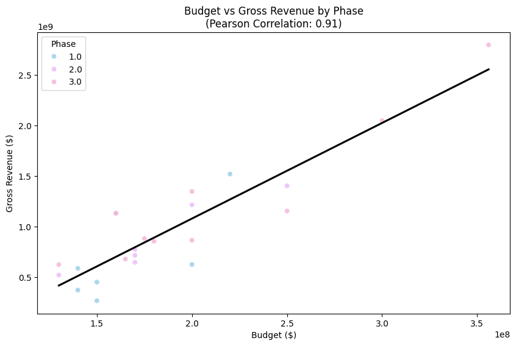
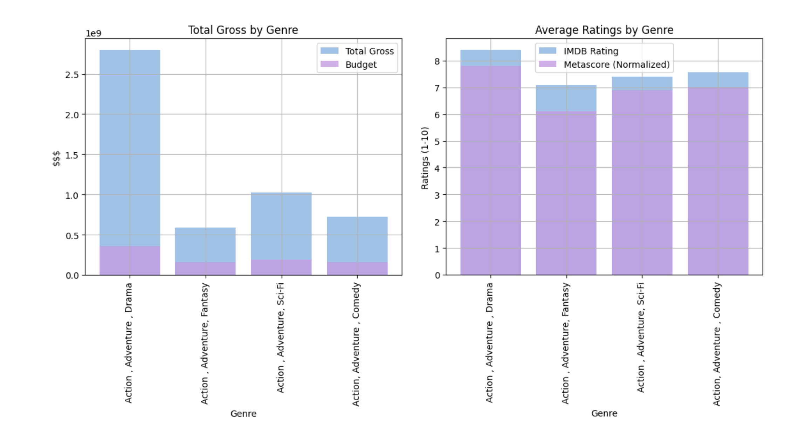
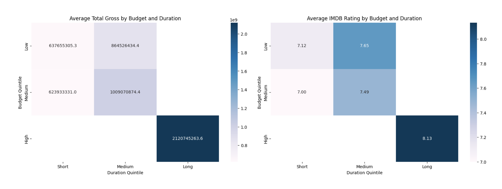
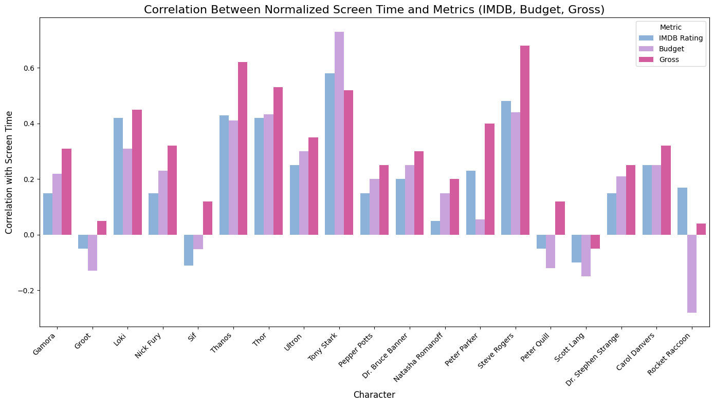
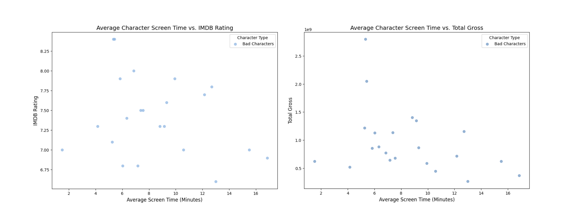
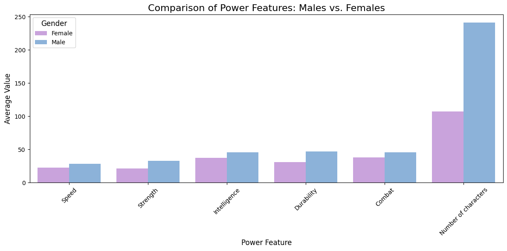
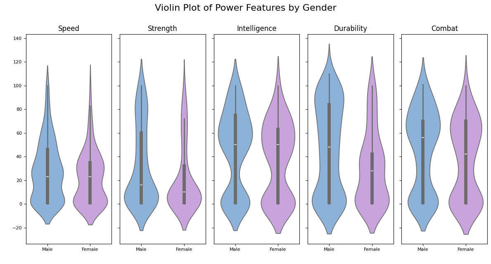

# Marvel Cinematic Universe – A Data Story

I wasn’t always an MCU fan — no comics, no quirky socks, no midnight premieres. But after binging the Infinity Saga with a True Believer, I was hooked. The humor, the heroes, the storytelling — it swept me away.

So when it came time to pick a project, I had one burning question:  
**What makes Marvel movies so successful?**  
Is it the heroes, the villains, the massive budgets, or the genre mashups?  
This data-driven journey was my way of finding out.

---

## 🧰 Tech Stack

- **Language:** Python  
- **Libraries:** Pandas, Matplotlib, Seaborn  
- **Tools:** Jupyter Notebook  
- **Data Sources:** Kaggle, Wikipedia, MCU fan sites  

---

## Workflow

1. Merged multiple datasets (budgets, ratings, character traits, screen time)  
2. Cleaned and completed data using public sources  
3. Conducted exploratory analysis (EDA)  
4. Created visualizations to answer key storytelling/business questions  
5. Summarized key insights  

---

## 🎬 MCU at a Glance

  
*A snapshot of Marvel’s cinematic success through budget and revenue patterns*

I started with datasets from Kaggle, covering budgets, revenues, IMDB scores, and character screen time. Merging these datasets was just the beginning — filling gaps meant digging into Wikipedia, Marvel fan sites, and more.

---

## Blockbuster Budgets: Bigger Is Better?

  
*Higher budgets correlate strongly with higher revenue (r = 0.91)*

Films like *Avengers: Endgame* demonstrate that Marvel's massive investments pay off. Phase 3 consistently outperformed earlier phases in revenue.

---

## Genre Impact on Success

  
*“Action, Adventure, Drama” performs best in both ratings and box office*

Marvel’s emotional depth (e.g., *Black Panther*) proved more impactful than lighter “Action-Comedy” blends.

---

## ⏱ The Length Effect: Longer Films, Bigger Wins

  
*High-budget + long duration = financial sweet spot*

Movies like *Infinity War* sit in the most profitable category.

---

## Runtime and Ratings

  
*Longer films correlate with higher IMDB ratings*

Marvel’s longer runtimes seem to allow deeper narratives and character development.

---

## Heroes in the Spotlight

  
*Lead characters with more screen time also drive better ratings and higher revenue*

Characters like Iron Man and Captain America have clear positive correlations.

---

## 😈 The Villain Effect

  
*Villains like Thanos boost emotional stakes — and audience reception*

  
*Stronger villains correlate with higher IMDB ratings*

Narrative weight given to villains may be a hidden success factor.

---

## ⚖️ Gender & Representation in Marvel

  
*Male characters dominate in physical traits like strength and combat*

  
*Female characters show a more balanced range of powers*

Marvel’s shift toward inclusivity is seen not just in numbers — but in how power is represented.

---

## 🔑 Key Takeaways

-  **Lead heroes drive success** – Screen time matters  
-  **The ensemble effect** – Group casts often perform better  
-  **Villains matter too** – Their presence impacts ratings  
-  **Genre mashups** – Action + Drama resonates more than pure comedy  
-  **Big budgets pay off** – High investment = high returns  
-  **The long game** – Runtime correlates with depth and success  
-  **Balanced representation** – Power dynamics are evolving

---

## 🧠 Final Thoughts

I didn’t crack Marvel’s formula, but I uncovered fascinating signals.  
More importantly, I learned how to merge, clean, and enrich complex data — and let it tell a story, even when it surprises you.

The MCU remains a mystery, but the tools I used here?  
They’re now part of my personal origin story.

---

## 📌 See More

- [🧠 Emergency Data Generator (Text + Audio)](https://github.com/AvivBachana/data_generator)  
- [📊 Predictive Classification Pipeline (Titanic)](https://github.com/AvivBachana/ML_FirstAssignment)  

