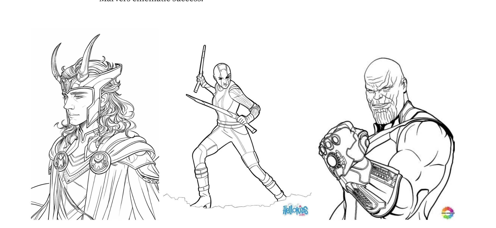

# Marvel Cinematic Universe Data Analysis

A data-driven exploration of the Marvel Cinematic Universe (MCU), focusing on patterns in diversity, ratings, budget trends, and franchise success across movies and phases. The goal was to extract storytelling and business insights using Python-based EDA.

---

## 🔧 Tech Stack
- **Languages:** Python  
- **Libraries:** Pandas, Seaborn, Matplotlib  
- **Environment:** Jupyter Notebook  

---

## 📊 Key Questions
- How has diversity in leading roles changed over time?
- Is there a correlation between audience ratings and box office success?
- How do budgets and revenue evolve across MCU phases?
- Which phases or franchises are most financially successful?
  
---

## 🧪 Workflow
1. Data cleaning (handling missing values, duplicates)
2. Exploratory Data Analysis (EDA)
3. Visualizations with Seaborn & Matplotlib
4. Insights & reflections

---

## 📷 Sample Visualizations

*Representation of female/non-white lead characters over time*

*MCU budget growth per phase*

*Audience rating correlation with worldwide revenue*

---

## 🔍 Summary of Insights
- Representation of diverse lead roles increased significantly in later phases.
- High audience ratings do not always translate to higher revenue.
- Phase 3 was the most financially successful and had the highest consistency in ratings.

---

## ▶️ How to View / Run
- All analysis is performed in Jupyter Notebook.
- You can view the notebook directly on GitHub or open it in Google Colab for interactive exploration.

---

## 📌 More Projects
- [Emergency Event Data Generator](https://github.com/AvivBachana/data_generator) – NLP + Audio + APIs  
- [Predictive Classification (Titanic ML Pipeline)](https://github.com/AvivBachana/ML_FirstAssignment) – Full E2E ML Workflow  

---

I wasn't always an MCU fan - no comics, no quirky socks, no midnight premieres. But after binging the Infinity Saga with a True Believer, I was hooked. The humor, the heroes, the storytelling - it swept me away. So, when it came time to pick a project, I had one burning question: What makes Marvel movies so successful? Is it the heroes, the villains, the massive budgets, or the genre mashups? This data-driven journey was my way of finding out.

I started with datasets from Kaggle, covering details like budgets, revenues, IMDB scores, and character screen time. Merging these datasets was just the beginning - filling gaps meant digging into Wikipedia, Marvel fan sites, and more. After stitching everything together and cleaning the data, I was ready to uncover what makes Marvel movies such a phenomenon.

---

## Setting the Stage: The Marvel Universe by the Numbers

To begin, I gathered a dataset encompassing movie details such as release dates, budgets, gross revenues, IMDB scores, and even detailed breakdowns of character screen time and attributes. After a thorough cleaning process, I was ready to dive into the data.
But where to start? Marvel's budgets often make headlines, so I asked a simple question: Do bigger budgets guarantee bigger payoffs?

---

## Blockbuster Budgets: Bigger Is Better?

Marvel doesn't shy away from massive budgets, with films like Avengers: Endgame boasting some of the highest production costs in cinematic history. When plotting budget vs. gross revenue, a clear pattern emerged: more money spent often means more money earned. With a strong correlation of 0.91, it became evident that Marvel's high-budget films are their most successful.
Interestingly, Phase 3 movies consistently outperformed earlier phases, suggesting Marvel's ability to refine its storytelling and marketing strategies over time.

---

## The Power of Genre: Action, Adventure, Drama

Next, I turned to the question of genre. Marvel's films often blend action, adventure, and sci-fi, but how do these combinations impact ratings and revenue?
The "Action, Adventure, Drama" genre emerged as a fan favorite, with the highest IMDB ratings and gross revenues. Films like Black Panther combine emotional depth with thrilling action - a combination audiences clearly love.

In contrast, lighter genres like "Action, Adventure, Comedy" tended to underperform in ratings, signaling that Marvel fans may prefer deeper storytelling when it comes to their superheroes.

---

## The Length Effect: Why Longer Films Win

One unexpected trend was the impact of movie duration. Marvel's longer films consistently outperformed shorter ones in both ratings and revenue. When breaking down movies by budget and duration, the most profitable category included long, high-budget films, exemplified by blockbusters like Avengers: Infinity War.

---

## Marvel's Metrics: Explore the Numbers

To better understand Marvel's formula for success, I created an interactive Tableau visualization titled "Movie Metrics". This visualization dives deep into the key metrics for each movie, including the number of female characters, total gross, IMDB ratings, and budget.

*View the Tableau Sheet Here*

---

## Heroes in the Spotlight: A Tale of Screen Time and Success

Marvel's characters are the heart of its universe, and their screen time often reflects their narrative importance. But does more screen time translate to better ratings or higher revenues?

When analyzing the screen time of Marvel's iconic heroes, a fascinating pattern emerges: characters like Tony Stark (Iron Man) and Steve Rogers (Captain America) consistently demonstrate positive correlations between their screen time and metrics such as IMDB scores and gross revenue.

---

## The Villain Effect

The analysis didn't stop with heroes. I also explored the impact of villains, like Thanos and Loki, on movie success.

Villains like Thanos, who dominated the narrative in Avengers: Infinity War and Avengers: Endgame, show strong positive correlations with metrics like IMDB scores.

---

## Gender and Representation in Marvel

Marvel's evolving representation of male and female characters reflects a broader industry shift toward inclusivity.

An analysis of power features by gender revealed a stark contrast: while male characters overwhelmingly dominate in traditional traits like strength and combat, female characters often showcase more balanced power distributions.

---

## Bringing All These Insights Together: Marvel's Winning Formula

Through our deep dive into the Marvel Cinematic Universe's data, we've uncovered several key ingredients that contribute to its unparalleled success:

- Central Heroes Drive Success
- The Ensemble Effect
- Villains Matter Too
- Genre Mastery
- Big Budgets Pay Off
- The Long Game
- Balanced Representation

---

## Final Thoughts

If this project taught me one thing, it's that crafting the next MCU is definitely not in my skillset. My initial speculations? Most of them didn't align with the data. Some results left me scratching my head, wondering how Marvel pulls it off. Clearly, Stan Lee and the team had a magic touch I can't replicate.

But while I didn't crack the Marvel formula, the journey was its own reward. I learned how to tackle complex datasets, pull insights from multiple sources, and let the data tell its story - even when it didn't fit my expectations.

The MCU remains a mystery, but the skills and lessons I gained are my real superhero origin story.

